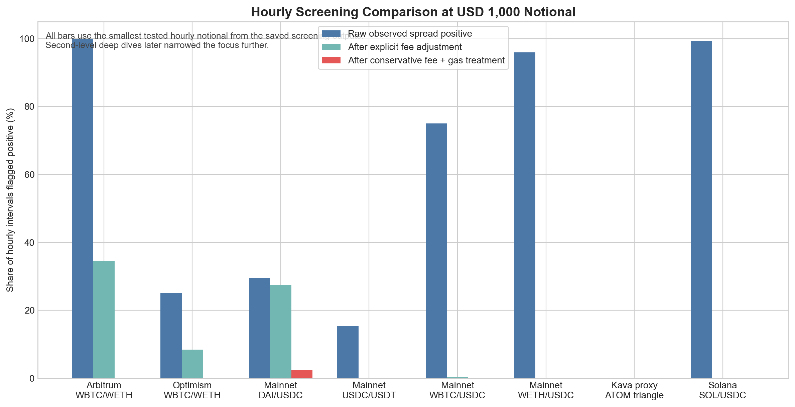
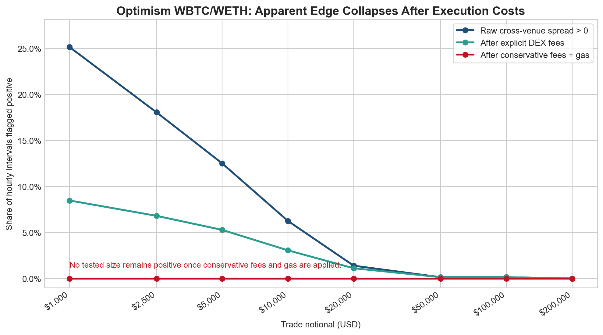
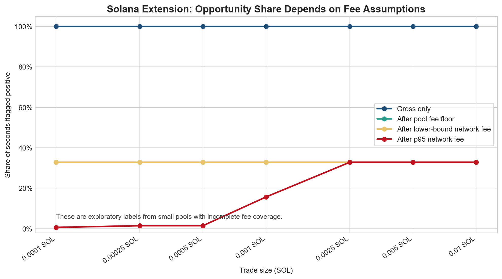

# FINS3666 Assignment 3 Final Report

## Progress Draft: Work Completed To Date

This report summarises the first half of our project. At this stage, the project is not presented as a completed trading strategy. Instead, it documents the research process, the evidence we gathered across multiple chains, pairs, and DEXs, and the conclusions we can support from the data collected so far.

## 1. Project Overview

Our project investigates **MEV arbitrage** in decentralised exchange (DEX) liquidity pools. The initial idea was to study whether temporary price differences between pools could be converted into profitable trades. In this setting, arbitrage means buying an asset from the cheaper pool and selling it into the more expensive pool before the price difference disappears.

We selected this topic because it is more specialised than a standard directional trading strategy and is closely connected to market microstructure. In automated market makers (AMMs), prices are determined by pool reserves rather than by an exchange order book. As a result, prices in individual pools can temporarily diverge from each other and from the broader market. However, it is not correct to assume that pools should always be mispriced. In practice, arbitrageurs usually push pool prices back toward equilibrium quickly, so the relevant question is whether the remaining discrepancies are large enough to survive execution costs.

## 2. Strategy Logic

The strategy we tested was cross-pool arbitrage. The economic logic is simple:

1. Identify two pools quoting the same trading pair.
2. Buy the asset in the pool where it is relatively cheaper.
3. Sell the asset in the pool where it is relatively more expensive.
4. Keep the difference only if the total trading profit exceeds all execution costs.

For this project, profitability depends on more than just observing a price gap. A visible gap is only the starting point. The trade remains attractive only if the gross spread is larger than:

- **Price impact (slippage):** the trade changes the pool reserves and therefore worsens the execution price.
- **DEX trading fees:** each swap pays a liquidity provider fee, so a round-trip arbitrage pays fees twice.
- **Gas or network fees:** the transaction must still be profitable after the blockchain execution cost.

Therefore, the true decision rule is:

**Arbitrage is feasible only when the spread exceeds price impact, DEX fees, and gas/network fees.**

## 3. Research Process

### 3.1 Broader Search Across Pairs And Venues

Although the original idea centred on **WBTC/WETH MEV arbitrage**, the project quickly expanded into a broader search once the first results looked weak. We tested several related markets and venue combinations so that the final conclusion would not depend on only one pair or one exchange setup.

The key screened combinations were:

| Market | Chain | Pair or Route | Main Venues / Pools Tested | Main Outcome |
| --- | --- | --- | --- | --- |
| Arbitrum WBTC/WETH | Arbitrum | WBTC/WETH | SushiSwap v2, Uniswap v2 | Raw spreads appeared often, but deeper 1-second execution modelling still found no net-profitable seconds. |
| Optimism WBTC/WETH | Optimism | WBTC/WETH | Uniswap v2, Velodrome v2 | Raw spreads survived some fee adjustment in the hourly screen, but the later 1-second execution test still found zero profitable seconds. |
| Base WBTC/WETH | Base | WBTC/WETH | Aerodrome candidate market, Uniswap v3 reference market | Not carried forward as an honest reserve-based backtest because two comparable reconstructable venues were not available. |
| Ethereum Mainnet USDC/USDT | Ethereum Mainnet | USDC/USDT | Uniswap v2, SushiSwap v2 | Quote differences existed, but no positive hourly intervals remained after fee adjustment in the saved screen. |
| Ethereum Mainnet DAI/USDC | Ethereum Mainnet | DAI/USDC | Uniswap v2, SushiSwap v2 | This was the strongest mainnet hourly screen, but the advantage shrank sharply after stricter cost assumptions and disappeared at larger sizes. |
| Ethereum Mainnet WETH/USDC | Ethereum Mainnet | WETH/USDC | Uniswap v2, SushiSwap v2 | Raw spreads were common, but no positive hourly intervals remained after fee adjustment in the saved screen. |
| Ethereum Mainnet WBTC/USDC | Ethereum Mainnet | WBTC/USDC | Uniswap v2, PancakeSwap v2 | Only a very small number of fee-adjusted positives appeared, and none survived the conservative fee-and-gas treatment. |
| Cosmos proxy route | Kava EVM / Cosmos proxy | ATOM/USDt/axlUSDC triangle | Equilibre ATOM/axlUSDC, Equilibre ATOM/USDt, Equilibre USDt/axlUSDC | Produced two small positive windows in the route-based second-level screen, but profits were only a few cents. |
| Solana extension | Solana | SOL/USDC | Raydium CPMM, Meteora DAMM v2 | Produced many candidate windows under lower-bound assumptions, but the pools were too small and the fee treatment too limited for a strong conclusion. |

This broader search matters because it shows that the project did not stop after one unsuccessful attempt. Instead, we tested multiple DEX combinations and several nearby pairs before narrowing the report to the markets that were most informative.

### 3.2 Initial WBTC/WETH Screen

We began with a broader screen of the **WBTC/WETH** market across major DEX venues. The purpose of this stage was to test whether the pair showed enough cross-venue price dispersion to justify deeper execution modelling.

The preliminary screen suggested that apparent price differences did exist at the quote level, but this by itself was not enough to confirm tradeability. This led us to move from a coarse-frequency screening stage to a more execution-focused dataset. The exact venue set also changed between stages because only some pools exposed the reserve-event structure needed for reliable historical execution modelling.

### 3.3 Higher-Frequency Optimism Execution Test

The next step was a **7-day, 1-second** reserve-based analysis of **WBTC/WETH on Optimism**. This stage was designed to model arbitrage more realistically. Instead of only comparing quoted prices, we reconstructed pool states from on-chain events and simulated whether a hypothetical trade could actually be executed profitably after accounting for price impact, pool fees, and gas assumptions.

This higher-frequency stage is the core result for the Ethereum-style leg of the project, because it tests executable profitability rather than simply identifying a quoted price difference.

### 3.4 Exploratory Solana Extension

After the Optimism results remained unconvincing, we explored whether a lower-fee ecosystem could improve the economics. For this reason, we extended the project to **Solana**, using an exploratory **SOL/USDC** setup. This was not a perfect like-for-like continuation of the WBTC/WETH analysis, but it served as a practical test of whether lower network costs could make arbitrage more viable.

This Solana stage should be treated as exploratory only. The reconstructed pools were small, the fee treatment was partly based on lower-bound assumptions, and the outputs should not yet be interpreted as proof of a scalable strategy.

## 4. Data And Method

The project reconstructs historical pool states from on-chain event data. For each selected pool, we track reserve changes through time, align the reserves to a regular frequency, derive the implied AMM price, and then simulate a hypothetical arbitrage trade between venues.

This methodology matters because simply comparing displayed prices is not enough. In an AMM, the execution price depends on trade size. A quoted gap may disappear once the trade actually moves the pool.

The current workflow is:

1. Collect or load on-chain pool events.
2. Rebuild pool reserves over time.
3. Forward-fill reserve states to a regular time grid.
4. Compute cross-venue price differences.
5. Simulate trade execution for selected trade sizes.
6. Compare gross edge against price impact, DEX fees, and gas/network fees.
7. Group consecutive positive seconds into opportunity windows rather than treating them as fully independent trades.

In practice, this workflow was used at two different levels:

- a **broader hourly screening stage** across several markets and DEX combinations, and
- a **deeper second-level execution stage** for the markets that looked most worth investigating further.

## 5. Findings So Far

### 5.1 Market Sweep Across Pairs And Exchanges

The broad screening stage already showed an important pattern: many pairs looked interesting at the raw quote level, but only a small minority remained attractive after costs, and almost none survived a stricter fee-and-gas treatment.

At the **USD 1,000 hourly screening notional**, the saved outputs show:

- **Arbitrum WBTC/WETH (SushiSwap v2 vs Uniswap v2):** 99.86% of intervals looked positive before costs, 34.58% remained positive after explicit fees, and 0% survived the conservative fee-and-gas treatment.
- **Optimism WBTC/WETH (Uniswap v2 vs Velodrome v2):** 25.14% of intervals looked positive before costs, 8.47% remained positive after explicit fees, and 0% survived the conservative treatment.
- **Ethereum Mainnet DAI/USDC (Uniswap v2 vs SushiSwap v2):** 29.44% of intervals looked positive before costs, 27.50% remained positive after explicit fees, and only 2.50% remained positive after the conservative treatment.
- **Ethereum Mainnet USDC/USDT (Uniswap v2 vs SushiSwap v2):** 15.42% of intervals looked positive before costs, but 0% remained positive after fee adjustment.
- **Ethereum Mainnet WETH/USDC (Uniswap v2 vs SushiSwap v2):** 95.97% of intervals looked positive before costs, but 0% remained positive after fee adjustment.
- **Ethereum Mainnet WBTC/USDC (Uniswap v2 vs PancakeSwap v2):** 75.00% of intervals looked positive before costs, only 0.42% remained positive after explicit fees, and 0% survived the conservative treatment.

The broader search therefore did not support a simple conclusion that “arbitrage was everywhere.” Instead, it showed that different market structures reacted differently to costs:

- stablecoin pairs could retain more of the quote-level spread after explicit pool fees,
- BTC and ETH pairs often looked attractive before costs,
- but once gas and stricter execution assumptions were applied, the practical edge usually disappeared.

The two extensions outside the main same-pair setup also need to be interpreted carefully:

- The **Kava/Cosmos proxy ATOM route** produced only **2 positive windows** across the saved second-level run, with maximum profit still below **USD 0.05**.
- The **Solana SOL/USDC extension** produced many more candidate windows, but under lower-bound assumptions and in very small pools, so it cannot yet be treated as a robust trading result.

**Figure 0.** Cross-market comparison of the hourly screening stage at the smallest saved notional. The main message is that raw spread counts are much easier to find than opportunities that remain positive after stricter execution costs.

### 5.2 Optimism WBTC/WETH: Apparent Spreads Did Not Survive Realistic Costs

The Optimism results show the main weakness of the original idea. At a surface level, many intervals looked promising because one venue often quoted a better price than another. However, once costs were applied, the opportunity disappeared.

From the saved hourly sensitivity outputs:

- A 30-day screen covered **720 hourly intervals**.
- At the raw observed-spread level, many intervals looked positive.
- After applying explicit DEX fees, the best case was only **61 positive intervals out of 720** at the smallest tested notional of **USD 1,000**, which is **8.47%** of intervals.
- After applying the more conservative fee-and-gas treatment, **no tested trade size remained positive**.

This result is even stronger in the higher-frequency execution dataset:

- The **7-day, 1-second Optimism WBTC/WETH run recorded 0 positive seconds**.
- It also recorded **0 positive opportunity windows**.
- This means the saved execution test did not find a single net-profitable arbitrage trade in that sample once costs were modelled.

The main lesson is that quoted inefficiency does not imply executable profit. Price impact can be reduced by trading smaller size, but DEX fees and gas costs do not disappear in the same way. In our results, those fixed trading costs were large enough to eliminate profitability.

**Figure 1.** Share of positive hourly intervals in the Optimism WBTC/WETH screen across trade notionals. The chart shows that raw quote differences are common, fewer intervals survive explicit DEX fees, and none survive a conservative fee-plus-gas treatment.

### 5.3 Why Smaller Trades Did Not Solve The Problem

One possible response to the slippage problem is to trade smaller size. This does help with price impact because a small trade moves pool reserves less aggressively. However, our results show that reducing size does not solve the entire problem:

- smaller size reduces slippage,
- but it also reduces the gross dollar profit from the spread,
- while DEX fees and gas still remain material.

As a result, a trade can look attractive before costs, survive slippage, and still fail after fees and network costs are included. This is exactly what happened in our Ethereum-style analysis.

### 5.4 Solana Extension: Many Candidate Windows, But Weak Economic Quality

The exploratory Solana extension produced a very different pattern. In this case, the model did identify a large number of candidate positive seconds under lower-bound cost assumptions:

- The sample contained **259,077 observed seconds**.
- **85,069 seconds** remained positive after the pool-fee floor and lower-bound network-fee assumptions.
- This is approximately **32.84%** of the sample.
- These positive seconds formed **123 opportunity windows**.
- The average window length was about **692 seconds** or **11.5 minutes**.
- The longest window lasted **4,206 seconds**, or roughly **70.1 minutes**.

At first glance, these results appear much more encouraging than the Optimism findings. However, the economic quality of these opportunities was still weak:

- the selected pools were extremely small,
- one reconstructed pool had only about **USD 132** in total value locked,
- another had only about **USD 3,270** in total value locked,
- the **maximum floor-estimated profit per window was below USD 0.09**,
- and some fee inputs were lower-bound approximations rather than exact full execution costs.

This means the Solana results should not be described as a robust profitable strategy. They show that lower-fee environments can produce more candidate opportunities, but the specific opportunities found here were too small and too assumption-sensitive to support a strong trading conclusion.

**Figure 2.** Share of positive seconds in the exploratory Solana extension under different fee assumptions. Gross opportunities were abundant, but the interpretation depends heavily on whether we use lower-bound or more conservative network-fee assumptions.

## 6. Interpretation

The evidence so far supports a clear intermediate conclusion:

**MEV-style cross-pool arbitrage is easy to identify at the quoted-price level, but much harder to justify once realistic execution costs are included.**

This is the most important result from the first half of the assignment. Our original intuition was that AMM pools should frequently show exploitable mispricing because prices are determined mechanically from reserves. That intuition was only partly correct. Temporary discrepancies do appear, but in the markets we tested they were usually not large enough, clean enough, or deep enough to produce realistic net profit.

The project therefore moved from a simple “find the mispricing” idea to a more realistic “test whether the mispricing survives execution” framework. That shift is important because it changes the conclusion from a superficial yes to a much more defensible no, at least for the current Optimism WBTC/WETH setup.

## 7. Current Conclusion

Based on the work completed so far, our current conclusion is:

- Across the **hourly screens on multiple pairs and DEXs**, many markets showed raw quote differences, but very few retained a convincing edge after realistic cost adjustments.
- The deeper **Arbitrum and Optimism WBTC/WETH second-level tests** did **not** produce executable net-profitable results in the saved runs.
- The strongest alternative hourly screen, **Ethereum Mainnet DAI/USDC on Uniswap v2 and SushiSwap v2**, still weakened materially once stricter costs and size effects were imposed.
- The **Cosmos proxy and Solana extensions** produced positive candidate windows, but these results remain too small, too fragile, or too assumption-sensitive to support a reliable trading claim.

Therefore, the project has not yet produced a convincing live-tradable arbitrage strategy. However, it has produced a useful and defensible research result: **apparent MEV arbitrage opportunities can disappear once we model realistic trading frictions properly.**

## 8. Next Steps For The Second Half

The next stage of the assignment should focus on improving the economic realism and comparability of the analysis. The most useful next steps are:

1. Test more comparable lower-fee markets with larger and deeper pools.
2. Improve fee modelling so that network and venue costs are estimated more precisely.
3. Evaluate whether the best opportunities remain profitable at realistic executable size, not just at minimal notional size.
4. Compare multiple chains using the same pair structure where possible.
5. Distinguish between raw opportunity counts and economically meaningful profit after all costs.

## 9. Interim Takeaway

At this point, the strongest conclusion is not that we discovered a profitable MEV bot. The stronger conclusion is that **execution realism matters more than raw opportunity counts**. Once slippage, swap fees, and gas are included, many attractive-looking arbitrage trades disappear. That finding is central to the project and provides a clear foundation for the second half of the assignment.
